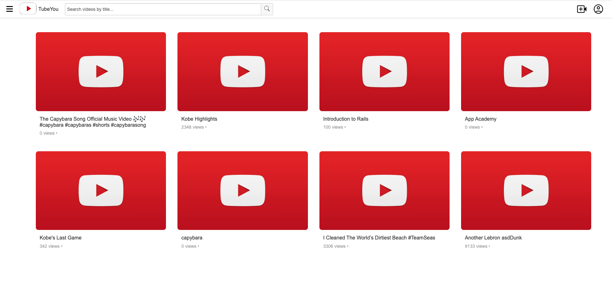
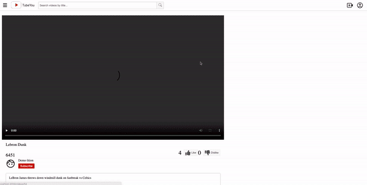
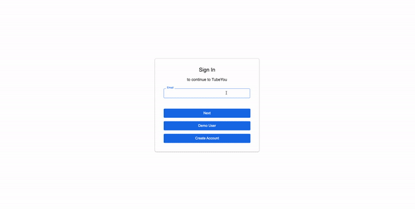
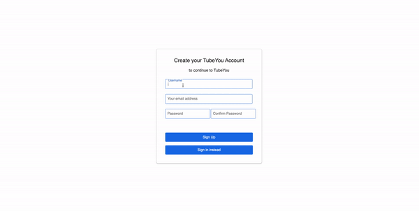
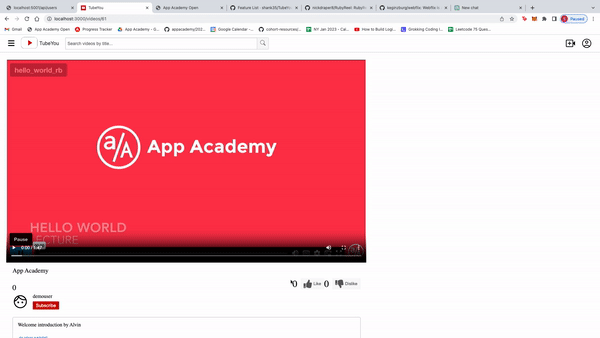

<div style="display: flex; align-items: center;">
  <a href="https://tubeyou.onrender.com/" style="display: flex; align-items: center;">
    
    <p style="font-size: 24px; margin-left: 10px;">TubeYou</p>
  </a>
  <p style="font-size: 14px; margin-left: auto;">Welcome!</p>
</div>


<h3 style="text-align: center">Share, explore, and discover</h3>

# Table of Contents
1. Introduction
2. Features
3. Recent Updates
4. Technology
5. A closer look
    * Video
    * Smart Errors
    * The Like Bar
6. Final Notes

# Introduction - At a glance



### [TubeYou](https://tubeyou.onrender.com/), a YouTube clone, is a video-sharing platform where users can watch, comment on, and like/dislike videos and upload and share their own videos.

### TubeYou was engineered to be responsive, efficient, user-friendly, and fun to use.

<br></br>

# Features
### A few of the things you can do on TubeYou:
* Watch videos
* Upload and manage your own videos
* Leave comments on videos
* Reply to comments
* Edit or delete your comment or reply
* Leave a like or a dislike on videos and comments
* Search videos by title using the search bar

# Technology
### This is a fullstack application that was built using the following technologies:
* Languages: Javascript, Ruby, HTML, and CSS
* Frontend: React-Redux
* Database: PostgreSQL
* Hosting: Render
* Asset Storage: AWS Simple Cloud Storage (S3)

# A closer look
### I want to take a closer look at a few features included in the development of TubeYou.

## Video

From the outset, my objective for TubeYou was to provide users with a seamless and effortless video watching experience. Achieving this required careful planning and execution, and I found the process of implementing this feature both challenging and exciting. It was a valuable learning experience to explore the various techniques and technologies that enable a smooth and intuitive user experience.

<div style="text-align: center"></div>

```js
  const VideoShow = ({ videoId, user }) => {
    const [video, setVideo] = useState(null);
    const [loading, setLoading] = useState(false);
    const [error, setError] = useState(null);
    const dispatch = useDispatch();
    useEffect(() => {
      const fetchVideo = async () => {
        setLoading(true);
        try {
          const response = await axios.get(`/api/videos/${videoId}`);
          setVideo(response.data.video);
          dispatch(receiveVideo(response.data.video)); 
          setLoading(false);
        } catch (error) {
          setError(error.response.data.message);
          setLoading(false);
        }
      };
      fetchVideo();
    }, [dispatch, videoId]);
    
    if (loading) {
      return <div>Loading...</div>;
    }
    if (error) {
      return <div>Error: {error}</div>;
    }
    return video ? <VideoPlayer video={video} user={user} /> : <div>Loading...</div>;
  };
```

## Smart Errors

My goal was to make the process of logging in and signing up for TubeYou seamless and effortless for users. To achieve this, I ensured that any errors encountered during the process were promptly reported from the backend and updated in the system state, enabling me to provide users with clear and precise error messages. With this approach, users can easily understand what's happening if a sign-in or login attempt fails, resulting in a more user-friendly and enjoyable experience.

<div style="text-align: center"></div>

During the signup process, I recognized that there are multiple fields that could potentially be invalid. To ensure that users can easily identify the erroneous fields, I implemented a feature that highlights the specific input field in red, making it immediately clear where the issue lies. In addition, a descriptive error message is displayed directly below the field, providing users with clear guidance on how to resolve the error. With this approach, users can quickly and easily complete the signup process without experiencing any frustration or confusion.

<div style="text-align: center"></div>

Drawing on my extensive experience as a user myself, I am keenly aware of the importance of presenting information in a clear and unambiguous manner. I recognize that users should not have to rely on guesswork or make assumptions about how to navigate a website or application. Therefore, I strive to provide them with the most transparent and straightforward user experience possible.

## The Like Bar
One feature that I find particularly notable is the video like bar, which I patterned after the one used by YouTube. The bar provides users with not only the ratio of likes to dislikes, but also the option to highlight the bar by liking the video. Developing this feature presented an enjoyable and intriguing challenge, and its implementation significantly enhances the website's aesthetic appeal and overall user experience.

<div style="text-align: center"></div>

```Javascript
  return (
    <div className="like-buttons">
      <span className="like-count">{likeCount}</span>
      <button
        className={`like-button ${likeStatus === true ? 'active' : ''}`}
        onClick={handleLikes}
      >
        <i className="fas fa-thumbs-up fa-2x"></i>
        Like
      </button>
      <span className="dislike-count">{dislikeCount}</span>

      <button
        className={`dislike-button ${dislikeStatus === true ? 'active' : ''}`}
        onClick={handleDislike}
      >
        <i className="fas fa-thumbs-down fa-2x"></i>
        Dislike
      </button>
    </div>
  );
```

# Final Notes
My initial project marked a significant milestone in my career as a developer, and I found the experience to be both stimulating and fulfilling. I approached each day with genuine excitement and was eager to develop new features and functionalities that added value to the product. While I'm keen to explore novel technologies and embark on fresh projects, I remain committed to augmenting TubeYou's capabilities with additional features during my free time.

## What I plan to implement:
* Number of plays
  * Videos will display the number of times they have been played.
  * Both logged-in and demo users will count toward views.
* Channels
  * Users will have their own channel where all their uploaded videos are kept.
  * Users will have the ability to personalize their channel according to their preferences.
* Subscriptions 
  * Users will be able to subscribe to other channels by clicking on the "subscribe" button.
  * Users will be able to see a list of channels that they are subscribed to.
* Video Tags 
   * Users can tag their videos to a certain category (sports, music, gaming, etc)
* Upvotes and downvotes for comments on videos
  * Logged-in users can upvote and downvote specific comments on specific videos.
  * Each comment shows the number of upvotes and downvotes on specific videos.
* Search results
  * Be able to search and receive users as well as videos
